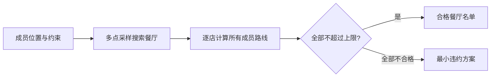

# 聚点聚餐 MeetPoint

> 为同城 2–4 人按各自通勤上限筛选聚餐地点，而不是让大家逐家手动比较路线。

MeetPoint 是一个 iOS 风格的 Expo / React Native 产品 MVP。发起人填写成员的出发地、可接受交通方式和最长通勤时间，系统搜索候选餐厅并逐家调用真实路线进行验证：存在严格合格结果时只展示合格名单；不存在时才展示最大超时最少的备选方案。

## 在线体验

公开体验地址将在首次 Vercel 部署完成后补充。

## 核心功能

- 发起人代填 2–4 位成员的昵称、地址、交通方式和时间上限。
- 地址与餐厅名称使用高德 POI 模糊联想。
- 支持公交地铁、驾车/打车、步行、自行车和电动车。
- 按通勤上限严格筛选；预算、想吃菜系和排除菜系均为选填。
- 真实高德地图展示成员名称、餐厅序号及地图/清单联动。
- 指定一家餐厅后，对所有成员计算五种交通方式。
- 餐厅价格缺失时保留结果并标注“价格待确认”。

## 产品逻辑



第一版使用个人开发者可用的高德基础 API，不依赖企业可达圈。候选搜索采用多种子点采样，最终资格以每家餐厅的真实路线验算为准。

## 技术栈

- Expo SDK 57、React Native、TypeScript、Expo Router
- React Native Web 静态导出
- Node.js / Vercel Functions
- 高德地图 JS API、POI 搜索与路径规划

## 项目结构

```text
app/          页面与路由
components/   UI、地址联想与高德地图组件
services/     前端 API 客户端
server/       高德服务端代理和选址计算
api/          Vercel Functions 入口
data/         首屏演示数据
```

## 本地运行

要求 Node.js 20 或更高版本。

```powershell
npm install
Copy-Item .env.example .env.local
```

在 `.env.local` 中填写自己的高德 Key。真实 Key 不应提交到 Git。

启动后端：

```powershell
npm run server
```

另开一个终端启动 Expo：

```powershell
npm start
```

如果使用手机上的 Expo Go，将 `EXPO_PUBLIC_MEETPOINT_API_URL` 改为电脑的局域网地址，并确保手机和电脑连接同一 Wi-Fi。

## 质量检查

```powershell
npm run typecheck
$env:EXPO_NO_DOTENV='1'; npm run build:web
```

## 部署

项目使用 Vercel 托管静态 Web 页面和同域 Serverless API。部署时只在 Vercel 控制台添加以下服务端环境变量：

- `AMAP_WEB_SERVICE_KEY`
- `AMAP_JS_KEY`
- `AMAP_JS_SECURITY_CODE`

生产 Web 不需要设置 `EXPO_PUBLIC_MEETPOINT_API_URL`。完整步骤见 [部署指南](docs/DEPLOYMENT.md)。

## MVP 边界

- 无登录、数据库、分享、投票和跨设备历史记录。
- 驾车时长使用当前交通状况参考，尚未实现未来时刻 ETD。
- 搜索为多点采样，不承诺穷尽城市内所有餐厅。
- 免费托管和个人高德配额只适合非商业作品集与小范围体验。

## License

[MIT](LICENSE)
